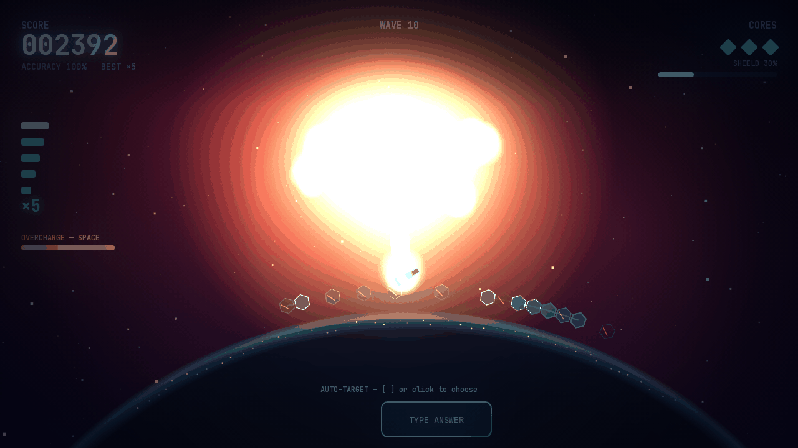
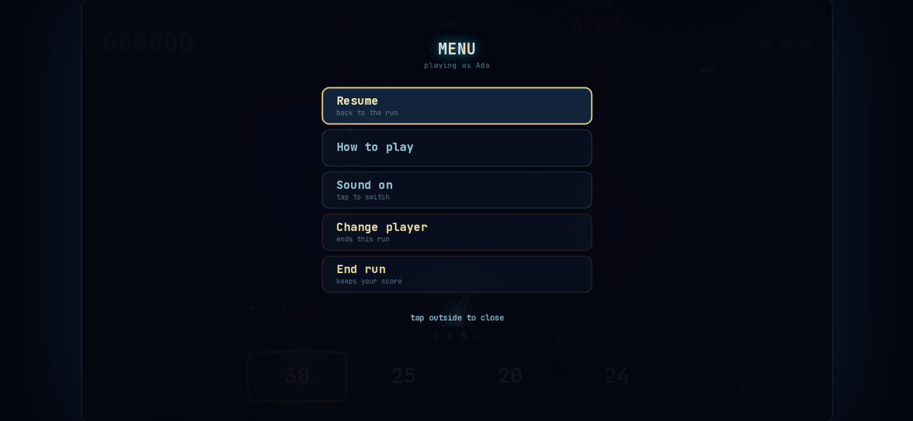
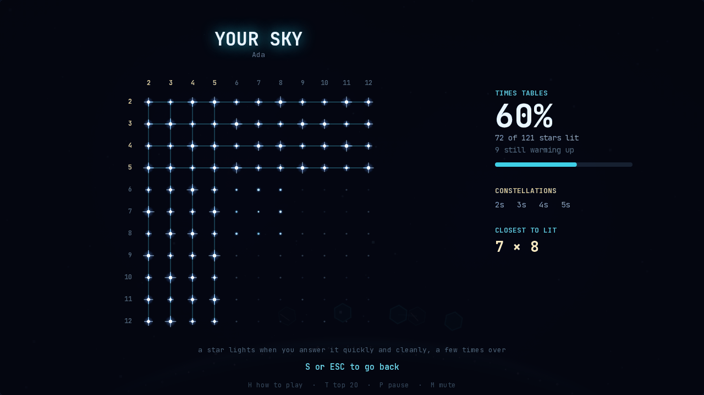
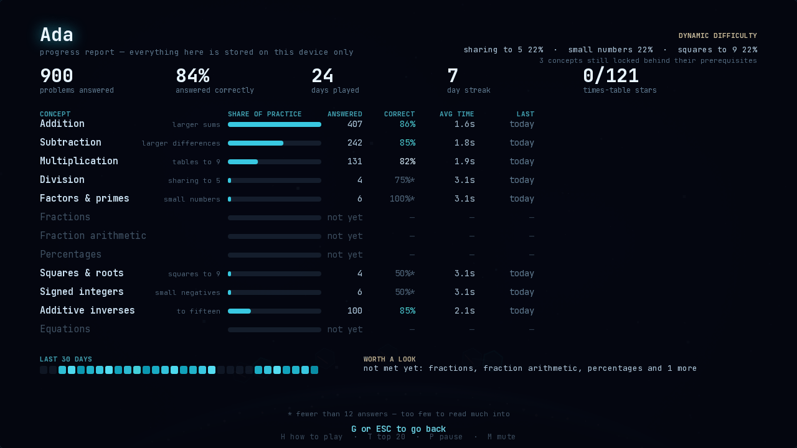

# MathBlast

A 90s-arcade math defence game rebuilt with modern graphics and audio. Beasts
descend toward your planet; the only way to stop one is to solve it.


## Difficulty

Three tiers, each a different curriculum rather than the same problems sped up.
Chosen on the title screen and remembered per player.

| | | |
| --- | --- | --- |
| **EASY** | Grades 1–3 | Single-digit addition and subtraction as base-ten blocks, single-digit times tables, division as equal groups, a missing-addend boss. Nothing above nine, no negatives. |
| **MEDIUM** | Grades 4–6 | Two-digit addition and subtraction, times tables to twelve, division, factoring and primes, unit fractions, additive inverses, a one-step equation boss. |
| **DYNAMIC** | Adapts | Starts as single-digit addition and opens the curriculum as each concept is mastered. Mastered material recedes to a trickle instead of vanishing. |
| **HARD** | Grade 7 | Signed integer multiply and divide, fraction sums with unlike denominators, percentages, squares and roots, a two-step equation boss with negative solutions. |


Easy draws addition and subtraction the way the material is taught: a rod is
ten, a square is one, and subtraction strikes out the part being taken away —
so a stuck player can count, exactly as they can count a `7 × 8` lattice.
Division is equal groups: `24 ÷ 8` is eight rings of three, and the answer is
what sits in one ring, so counting a single group is enough.

**Each tier ramps at its own rate.** Descent speed and wave size used to be
`34 + wave * 4` and `3 + wave * 1.4` for everybody, with only a per-tier
multiplier on top — so Easy thickened as fast as Hard and had fourteen beasts
falling in eleven seconds by wave ten, which is not a grade-2 experience. Easy
now adds 1.6 px/s and 0.6 beasts a wave against Medium's 3 and 1.1, and both
plateau. What Easy used to reach at wave ten it now reaches around wave thirty,
with ten beasts rather than fourteen. The point of the tier is repetitions on
the basics, and a curve that outruns the player after eight minutes does not
give them any.


Hard reuses the same rule. Negatives are dark chips with a bright rim, borrowed
from the voidling, so the sign rules are learned by seeing which pairings make
which result. A percentage is the lit part of a ticked bar. `7²` is a square
asking for its area and `√81` is the same square asking for its side.

## The design rule

> The math should *be* the graphics, not decorate them.

A `7 × 8` beast is a countable 7-by-8 lattice, so multiplication looks like area.
A `48` asteroid struck with `6` fractures into two chunks physically sized `6`
and `8`. A prime glows red and refuses to split, so the only way to kill it is to
name it. Nobody is told what a prime is — the rock teaches it by being
unbreakable.

## The Kraken — every tenth wave



The boss the game shipped with was a shell holding one equation, 156px across
— **shorter than an ordinary nine-by-twelve multiplication lattice** — with no
announcement, no camera change and no music change. It was reported as "I have
not seen the bosses", which is the correct reading of something that looks
smaller than the thing beside it.

Wave ten is an encounter instead. The camera **pulls back to 0.74** to open the
field, a core hangs above the dome, and arms spiral around it holding problems
drawn from whatever the player is currently working on. Every few seconds an
arm glows, lets go, and drives at the planet at about 2.6 seconds' flight —
against eleven to nineteen for a normal descent. The pressure is the clock, so
**hitstop and slow motion are suppressed for the duration**: the fight should
not keep stopping to admire itself.

The last arm does not kill it. The core splits open, the turret winds up, and
one shot finishes it — a white line into the middle of the thing, then a
detonation that fills the upper half of the sky and rains orbs onto the shield.

The arms are ordinary beasts in `game.beasts`, so targeting, answering,
scoring, the skill table and the progress ledger all work on them without
knowing the Kraken exists.

### The gauntlet — Arcade's fiftieth wave

All ten guardians, back to back, in the order the run met them: Bulwark,
Kraken, Twins, Hydra, Remainder, Balance, Cipher, Prism, Nought, Echo. Each at
its wave-fifty strength, with the supernova and the beat before the next one's
first salvo as the only breather. A row of the ten remnant glyphs sits in the
HUD and fills in as they go down, and the run ends on a congratulations rather
than on a distance covered.

Practice keeps its single Echo. The gauntlet is what makes Arcade the
achievement rather than just the longer track.

## The menu



**☰** on a phone, **ESC** on a keyboard. One labelled list that adapts to what
you are doing: Resume, How to play, Sound, Change player and End run inside a
run; Play, Top 20, Your sky and Progress outside one.

On a touchscreen the title screen also carries those four as buttons, so the
common destinations are one tap rather than two. They replaced a line reading
`H HOW TO PLAY  T TOP 20  S YOUR SKY  G PROGRESS` — nine keys named across the
title and game-over screens that do not exist on a phone. The keyboard strip
along the bottom is hidden there for the same reason, and name entry gained a
**BACK** button: it had only ESC, and a tap outside the field refocused it, so
on a phone it was a one-way door.

It replaced a row of five unlabelled glyphs — `?` `||` `★` `✦` `▤` — which was
what touch navigation had grown into, and which vanished entirely mid-run. The
bug underneath was worse than the clutter: **there was no way out of a run on
any input.** ESC while playing clears the answer box and falls through, so
changing player meant dying or reloading the page. ESC now clears the box if
there is something in it and opens the menu if there is not; Android's back
button does the same.

Leaving a run through the menu records its score exactly as dying does — a run
is never quietly binned — and the two entries that end a run are marked in red
and placed last, where a stray thumb will not find them.

## Players and scores

First launch asks who is playing. A profile owns its own fact history, so two
people sharing a device get their own adaptive difficulty rather than averaging
into one blurred learner — and its own personal bests. The score table is global
across profiles, because a shared leaderboard is the point of having names.

Everything lives in `localStorage`; a run that beats a record says so on the
game-over screen, and the top five sit under the title.

The table holds **twenty** places. Twenty rows do not fit the gap the title
screen has for them, so they get their own screen — **T**, or the ★ button on a
phone — laid out as two columns of ten with the score, wave and difficulty each
run was set on, and the run you just finished picked out in gold. The game-over
screen already announced a placing (`#13 ON THE BOARD`) that the five-row
preview could not show, which is most of the reason a deeper table needs a
screen of its own.


## On a phone

Touch is detected from the pointer media query, which switches the game to the
pick-an-answer layout, enlarges the answer targets past the ~44px physical
minimum once 1280×720 is scaled to a phone, and puts a beam, pause and help
button in the bottom corners where thumbs already rest. Tap a beast to aim at
it. An upright phone gets a rotate prompt — a 16:9 playfield in portrait is too
small to read.

Name entry hands off to a real `<input>` laid over the canvas, so phones raise
the native keyboard instead of a letter grid nobody wants to thumb through.


## Running it

No build step and no dependencies.

```bash
npm start          # -> http://localhost:5173
npm test           # browser-driven suite (needs Playwright; skips cleanly without)
```

Any static server works. It must be served over HTTP rather than opened as a
`file://` URL, because the code uses ES modules.


### Controls

| Key | Action |
| --- | --- |
| `0`–`9`, `/`, `x`, `-` | Type the answer (`/` for fractions like `3/4`; `x` types `×` for pairs like `6×8`; `-` for negative answers) |
| `←` `→` | Choose difficulty (on the title screen) |
| `Enter` | Fire &nbsp;·&nbsp; `Backspace` delete &nbsp;·&nbsp; `Esc` clear |
| `[` `]` or click | Choose which beast to solve; otherwise the turret auto-targets the most dangerous one |
| `Space` | Overcharge beam, once charged |
| `Tab` | Switch between typing and picking from four answers |
| `C` / `R` | Colour-safe palette / reduced motion |
| `ESC` | Switch player (from the title) |
| `H` | How to play — every control and beast in one screen, from the title or mid-game |
| `P` / `M` / `Q` | Pause / mute / graphics quality (also `?q=low\|medium\|high`) |

Targeting is automatic until you override it. Click or tap a beast, press `[`
and `]`, or use the gamepad shoulder buttons to aim somewhere else; the lock
holds until that beast is solved, then the turret resumes defending on its own.

Touch and gamepad auto-switch to the four-answer layout: tap an orb, or use
d-pad + A, with B or RT for the beam.

## The beasts

| | |
| --- | --- |
| **Multiplication lattice** | `a × b` as a countable grid. Solving runs a diagonal collapse wave through it, so the kill animation is a picture of the array being consumed. |
| **Splitting asteroid** | Labelled `? × ? = 48`, and it accepts either half of that question: one factor (`6`) or the whole pair (`6×8`). A pair is judged on its product, so `12×9` is wrong for 48 even though `12` alone would be right. Hit a composite and it fractures into two proportionally sized rocks. Composites show fracture seams; primes show an unbreakable crystalline core. Trying to factor a prime costs nothing — the rock reveals itself as `17 is PRIME` and you name it instead. |
| **Fraction crystal** | Labelled `? / 8`, a shell with a wedge missing, faceted at every `1/q` so the denominator is countable. Takes the counted numerator (`3`) or any equivalent fraction (`3/8`, `6/16`). |
| **Voidling** | A negative. Rises instead of falling, drawn as a hole rather than an object. Fire its additive inverse to annihilate it; let it escape off the top and it takes shield energy with it. |
| **Boss equation** | `3x + 7 = 22`, cracked one step at a time: isolate, solve, verify. Each step shatters one of three armour rings, so the algebra and the armour come apart together. |


## Impact

Every explosion is scaled by the magnitude of the problem that produced it. A
`2 × 3` gets two thin rings and five orbs; a `12 × 12` gets four fat ones and
nine, with a longer hitstop, a heavier shake and a lower, wetter kill tone.


The rings are drawn three times at slightly different radii in red, green and
blue, which reads as a lens distortion without ever sampling the canvas back — a
true refraction pass costs a full-resolution readback per ring, and these stack.

**Orbs carry the game's central idea.** Solving a beast releases energy that
scatters, then arcs down into the shield dome and is absorbed, each orb
depositing a share of a plate. The answer you got right becomes, visibly, the
thing that protects you later — and it pays off mechanically, because an intact
plate absorbs a landing that would otherwise cost a core.


## Installing it as an app

The game is an installable PWA: a manifest that asks for fullscreen and
landscape, maskable icons, and a service worker that precaches all 46 files. It
boots and plays with the network off — the typeface ships in `assets/font/`
rather than coming off Google Fonts, which an installed app cannot reach on a
plane. `npm test` fails if the precache list drifts from what is on disk, so
adding a source file cannot silently break the offline build.

Installed, it also does the things a page has to do for itself that an app gets
from the OS: a wake lock so the screen does not dim mid-problem, an orientation
lock, safe-area padding so a notch does not sit over the canvas, and Android's
back button closing an overlay instead of the app.

Played in a browser tab rather than installed, the first tap asks for
fullscreen and then locks landscape — in that order, because
`screen.orientation.lock()` rejects unless the document is already fullscreen.
It keeps asking on later taps rather than giving up after one refusal, so
leaving fullscreen is recoverable, and stops after three consecutive refusals
from a browser that will not allow it. Where it is refused outright the canvas
sizes itself to `visualViewport` instead of `window.innerHeight`, so the
playfield sits beside the browser's bar rather than behind it.

No build step means any static host serves it straight from the repo root, and
every shipped URL is relative so a subpath host works too — GitHub Pages, then
**Add to Home screen** on the phone, gets you the installed app without
building anything. For an actual Play Store listing it wraps in Capacitor
(`npm run app:apk`). Both routes, and the parts that are paperwork rather than
code, are in [docs/ANDROID.md](docs/ANDROID.md). What it would take to *sell* it, with the
web version left free -- what the paid app can honestly offer that this one does
not, and the fourteen-day Play testing gate that dominates the schedule -- is in
[docs/MARKETING.md](docs/MARKETING.md), and what each store requires before it
will take the app is in [docs/COMPLIANCE.md](docs/COMPLIANCE.md).

## Your sky



The skill table has kept `{ema, misses, seen}` for every fact, per profile,
since the adaptive difficulty went in — and showed the player four items of it
on the game-over screen. **S** turns that into the thing you fly against: one
star per times-table fact, dim when unseen, brightening as the answers get
faster and cleaner, flaring when a fact is genuinely known. Light a whole row
and the stars join into a constellation, so "I've got my fives" becomes
something that visibly happened.

A star lights on speed *and* accuracy *and* repetition, all three — one lucky
fast answer is not mastery, and neither is a slow correct one. Mid-run, the
moment a fact crosses the line the game says so; it always knew, and never
mentioned it.

Fixing this surfaced a bug it would have put on screen: facts were keyed
`${a}*${b}`, so `7 + 8` and `7 × 8` were the *same entry*. The adaptive
weighting mixed them and the game-over list rendered both as `7×8`. The op is
part of the key now, and records saved before it are read as multiplication,
which is what they were.

## Dynamic difficulty

A fourth option beside Easy, Medium and Hard. It is not a blend of them: what a
learner needs is for the material they have mastered to recede and the material
they have not to arrive, and that happens concept by concept, not tier by tier.

Every concept-and-level carries a weight that falls as it is mastered, and the
spawn roster is drawn from those weights. Mastering single-digit addition does
two things at once — single-digit addition's own weight collapses, and the
concept promotes to two digits, whose row in the ledger is empty and therefore
heavy. A concept's share over time is a wave that moves up the levels, not a
line that only falls. Simulated over two thousand problems:

```
problems | single-digit add | two-digit add | larger sums  | tables to 9
     200 |               4% |           31% |          0%  |         0%
     400 |               2% |            4% |         28%  |         0%
     600 |               1% |            2% |         10%  |         0%
     800 |               1% |            2% |          8%  |        52%
    1400 |               1% |            1% |          4%  |         7%
    2000 |               1% |            1% |          5%  |         1%
```

Mastered levels keep a thin share rather than switching off — spaced retrieval
is why the basics stay in rotation at all. A concept stays locked until its
prerequisites are solid, so a child who has not met multiplication is never
shown a fraction, and the ledger is the only source of truth: there is no second
copy of "how far along are they" to drift out of sync.

The live ratio is on the title screen and the progress report. Adaptive
difficulty that will not say what it is doing is just an unexplained spike.

## Progress report — `G`



A page for whoever is keeping an eye on the practice. Concepts in curriculum
order, each with its share of the practice, how many were answered, how many
correctly, how long they take and when they were last met — plus the ones never
touched at all, which are the most useful rows on the page and so cannot be
absent ones.

Three deliberate choices:

- **Coverage and accuracy are separate columns.** "Never seen" and "seen and
  struggling" need completely different responses, and one blended number hides
  which you are looking at.
- **Under a dozen answers, the percentage is marked and greyed.** A confident
  63% off four attempts is noise dressed as a finding.
- **"Ran out of time" is counted apart from "got it wrong."** A beast that
  reached the dome unanswered is a different conversation from a wrong answer.

There is no grade and no percentile. This is one game's telemetry, not an
assessment, and presenting it as a mark out of ten would claim more than the
data supports.

Building it turned up the reason it was needed: the skill table only ever
recorded facts carrying an `(a, b)` pair — **four of the twelve beast types**.
Factoring, fractions, fraction arithmetic, percents, powers, additive inverses
and the equation bosses recorded *nothing*, so half the curriculum was
invisible and a coverage page would have implied it was never practised. Every
beast now declares a `concept`, and a test spawns thousands across all three
tiers to assert none of them falls through.

Everything is `localStorage` on the device. Nothing is sent anywhere.

## Chaining

Solving a beast takes out its neighbours whose answers share a factor with it —
a bolt jumps from `6` to `24` to `12` and they go together, for 40% each. The
only tactic the game had was *answer fast*; this makes noticing that six and
twenty-four are related worth something, which is the actual mathematical skill
rather than the typing speed. Everything chained relates to the answer you
*typed*, not to the previous link: "all the ones related to what I solved" is a
rule a nine-year-old can hold, and a propagating one is not. Chained beasts pay
out but never touch the combo, the accuracy or the skill table — you did not
answer them.

## The last core

The danger ramp is continuous by design, which left the game with no spikes in
it. At one core the colour drains out of the world, the vignette closes, every
melodic layer drops away and the kit carries it alone, and the game says LAST
CORE across the middle. It is the one place the game raises its voice.

## Sound

Fully synthesized — no audio assets, not even an impulse response.

- **The combo melody is harmonised.** Each correct answer plays a tone of the
  chord *currently sounding*, climbing one chord tone per combo step. A streak
  plays a melody that fits the backing rather than sitting on top of it.
- **The mode follows the player.** Rolling accuracy indexes a list of modes from
  Phrygian to Ionian. Play well and the chord literally becomes a major triad;
  miss a few and it darkens. The soundtrack narrates competence, not just threat.
- **Tempo and progression advance with the wave** (100 → 124 BPM, four rotating
  progressions), so minute eight does not sound like minute one.
- **Everything is quantized to the beat grid**, which is most of the difference
  between "arcade noise" and "you are playing the track".
- **Five stems fade in with proximity**, making the mix double as a threat meter:
  silence at the top of the screen, drums by the time something is about to land.
- **The arrangement escalates by sector.** Every three waves the track moves up
  a stage: a melodic hook enters and thickens (0 → 6 → 9 → 12 notes a bar), the
  bassline adds offbeat stabs, and a sidechain pump deepens from nothing to
  0.54. Tempo runs 100 → 136 BPM. Each wave arrives on a charge that is locked
  to a bar line and schedules its own arrival, so the interlude runs for exactly
  as long as the music needs rather than a fixed count that lands wherever it
  lands. The charge is the tonic chord swelling in under a pulse that
  accelerates into the bar line — pitched material only, peaking quieter than
  the loudest tenth of ordinary play, so it reads as energy gathering rather
  than a transition effect over the top of the score.
- **The kit plays phrases, not a loop.** Each sector has its own sixteen-step
  pattern written as velocity strings, running 8 → 15 → 27 → 33 onsets a bar as
  the kick syncopates and ghost snares fill the gaps. Every four bars close on a
  tom fill and the next opens on a crash, velocities wobble a few percent, and
  the hats drift by under a millisecond — a grid-locked hat line rings like one
  long tone rather than a series of hits. Only accented kicks drive the
  sidechain; a ghost kick pumping the mix sounds like a fault, not a groove.
  The drums also arrive earlier every sector (danger 0.62 → 0.11), so by
  CRIMSON DEEP the kit is simply always there.
- **The mix is the stakes.** On the last core `stark` drops the pad to a third
  and mutes the arp and lead entirely, so the drums carry the run out alone. A
  new run puts them back.
- **Panned by screen position**, with a convolution reverb built from
  exponentially decaying noise, and a held breath — everything cuts, the tail
  carries — between waves.

Wrong answers never buzz. The beast lurches closer and the combo resets, but
there is no harsh error tone and the problem stays on screen. The punishment is
proximity, not a scolding.

## Sectors

Progress is banded rather than smeared — twelve degrees of hue a wave is
invisible while you are playing. Every three waves the sky changes sector, with
its own name, nebula strength and star tint, announced on the wave banner.

| Wave 1 — Blue Drift | Wave 10 — Crimson Deep |
| --- | --- |
|  |  |

## Feel

- **75–140ms hitstop** on kills, scaled by magnitude.
- **The near-miss frame**: past 86% descent the game drops to ~32% time scale,
  drains the world to greyscale, softens the backdrop with depth of field, and
  redraws the problem and your input in full colour on top.
- **Wave transitions are a beat**, not a banner: the camera pulls back,
  everything holds, and a clean wave gets a resolving chord and a repaired plate.
- **The planet is a character** — shield coverage is how much of the world dares
  turn its lights back on. Cities kindle one at a time as the dome is rebuilt,
  each guttering like a cold tube before it holds, aurora ribbons thicken over
  the limb, and every absorbed orb flares the cities under where it landed.
  Hold the dome *whole* and the world starts building: roads reach between the
  lit cities, spreading outward from the apex over about half a minute, and
  unwinding again if it is breached. Past that, the orbs a full dome has no
  room for stop being just score — each one pays into a fund, and the world
  founds an outpost further south with a road out to it, so the settled land
  creeps down and out across the face of the planet for as long as you hold the
  shield and keep answering — twenty-six of them, reaching the whole of the
  visible ground from x=246 to x=1016 and down to the bottom of the frame. A perfect wave sends the news out along the limb, lighting
  each city as it arrives. Cities go dark a cluster at a time as cores are
  lost, and a beast that gets through leaves a crater that **burns** — coals
  scattered through the bowl, each at its own rate, cooling over eight seconds
  to an ember bed that never quite goes out.
- **Overcharge** builds when you answer faster than your own rolling average,
  rewarding fluency rather than mere accuracy, and discharges as a column beam.


## Learning model

Every fact carries an EMA of your solve time plus a miss count, persisted to
`localStorage`. Spawn weight derives from that, so the facts you are slowest on
appear most often, and the game-over screen names them. Distractors in
four-answer mode are the mistakes learners actually make — off-by-one-group, a
transposed digit, the sum instead of the product — not random numbers, which are
easy to eliminate without doing the maths.

## Accessibility

`R` toggles reduced motion (auto-detected from `prefers-reduced-motion`), which
cuts screen shake to a tenth, halves hitstop and disables the slow-motion
punch-in. The scaling lives in the camera rather than at each call site, so no
effect can forget to honour it.

`C` toggles a colour-safe palette. Friendly is always cool and hostile always
warm — that contrast is how the screen is read at a glance, so waves never
recolour it, only the environment drifts. The colour-safe palette widens the
split onto the blue-yellow axis, the one deuteranopia and protanopia leave
intact, and the types are distinguished by shape as well as hue.


## Architecture

```
index.html          canvas + letterbox shell
serve.js            zero-dependency static server
test/run.mjs        browser-driven test suite
src/
  main.js           game loop, waves, hit resolution, impact pipeline
  audio.js          synthesized adaptive score + beat-quantized SFX
  problems.js       adaptive fact table, weighted spawning, distractors
  theme.js          palette, colour-safe and reduced-motion state
  quality.js        frame-time-driven effect tiers
  util.js           math/easing helpers, the magnitude -> power curve
  entities/
    beasts/         base + mult, split, fraction, voidling, boss
    shield.js       dome, plates, aurora, planet, city lights, roads, scars
    projectile.js   answer bolt and turret
  fx/               camera (shake, hitstop, slow-mo), particles,
                    shockwaves, orbs
  render/           post-processing chain, parallax starfield
  ui/               HUD, choice layout, overlays
```

Canvas2D at a fixed 1280×720, letterboxed by CSS. A few decisions worth knowing:

- **No intermediate scene buffer.** An unconditional full-resolution copy cost
  ~15ms/frame on a software rasteriser, so post effects run in place.
- **Chromatic aberration rides the quarter-res bloom buffer**, so a frame pays
  for exactly one full-res composite whether or not it is active.
- **The nebula and its blurred copy are baked** into caches refreshed five times
  a second. Re-blurring a full-resolution backdrop every frame for the
  depth-of-field cost 16ms on its own.
- **The backdrop draws outside the camera transform**, because it is exactly
  screen-sized and zoom or shake would expose bare canvas at the edges.
- **Lattice cells are bucketed by brightness** and filled as four paths rather
  than one fill per cell — six 9×9 beasts was the largest single draw cost.
- **Quality adapts** to measured frame intervals with hysteresis.

### Performance

Measured under a software rasteriser with no GPU, so treat these as a pessimistic
floor rather than what real hardware sees — the full-resolution composites that
dominate the high tier are close to free on an accelerated canvas.

| | high | medium | low |
| --- | --- | --- | --- |
| Typical play | 21.8ms | 20.1ms | 8.4ms |
| Worst case (8 beasts, 45 orbs, 20 rings, slow-mo) | 42.6ms | 28.5ms | 17.3ms |

I have no way to verify GPU frame times from this environment. The adaptive
quality manager and the `?q=` override are the mitigation.

## Testing

`npm test` drives the real game in headless Chromium and asserts on live state —
81 checks covering the impact pipeline, magnitude scaling, every beast type,
overcharge, landings, the adaptive music, both accessibility modes, both input
modes, game over and restart, plus an end-to-end run to wave 7.

Two of them exist because of real failures the logic tests could not see:

- Boulders originally rendered a bare `48` with no question anywhere near them,
  and the only instruction was HUD text shown for the targeted beast alone. The
  suite now asserts that no beast renders its prompt as just a number.
- Batching lattice cells into four fills for performance used a `roundRect`
  helper that called `beginPath()`, so each cell discarded the previous one and
  only four cells per beast were ever drawn. The suite now samples the canvas
  and counts lit cells, which is the only way to catch a rendering bug of that
  shape.
- The name field carried `maxlength="12"`, which truncated the *raw* string
  before whitespace was collapsed, so "  Ada  Lovelace" became "Ada Lovel".
  `cleanName` is now the only place that caps length.
- The wave build used an exponential gain ramp — a factor of thousands, which
  stays inaudible until the last tenth and then jumps, landing as a zip rather
  than a rise. The suite now renders it in an `OfflineAudioContext` and asserts
  the envelope climbs and that the loudest moment is the drop.
- "The drum sounds dumb" turned out not to be a timbre problem. Measuring each
  voice through a filter bank in an `OfflineAudioContext` showed every band it
  needed — the kick's beater click peaks at 0.31 above 7 kHz, the snare spreads
  across 250 Hz to 9 kHz. What was wrong was the pattern: kick on 1 and 3, snare
  on 2 and 4, straight hats, byte-identical every bar for the entire game. That
  is a metronome. The fix was a pattern engine with per-sector kits, velocity,
  fills and phrase structure. (The first version of that filter bank measured
  every voice as a flat 0.16 across all six bands, which is the shape of a
  broken instrument: `start()` leaves its sequencer running, so a full track was
  playing underneath each "single voice" render. A control tone through the same
  bank is what caught it.)
- The kit was gated on `danger > 0.62` in every sector, so most of a run had no
  percussion at all. The suite now probes the real gate by recording what
  `setDanger` asks the drum layer for, rather than restating the formula.
- The wave transition was an EDM riser — noise sweeping to 4 kHz, an
  accelerating snare roll, a sawtooth climbing a fifth, a film-trailer sub drop.
  Rendered offline it peaked at RMS 0.35 against ordinary play's 0.12, so it was
  nearly three times louder than the loudest tenth of the game it interrupted.
  That is what "the sound aesthetic doesn't work" measures as. The charge that
  replaced it sits at 0.099. A loudness assertion needs something to compare
  against, so the suite now renders a reference bar of gameplay alongside it.

The suite also opens a second, touch-enabled context at phone dimensions and
drives the whole flow by tapping — profile creation, starting a run, answering,
the beam and help buttons — because none of that is reachable from the desktop
page.

## Licence

**GPL-3.0-only** — see [LICENSE](LICENSE). The game is free to play on the web
and free to build from source; anything derived from it has to stay under the
same licence, which is the point. The typeface in `assets/font/` is not mine and
is not covered by it: JetBrains Mono is SIL Open Font License 1.1, and its terms
travel with it in `assets/font/OFL.txt`.

"MathBlast", and the store listing that carries the name, are not part of the
licence grant.
